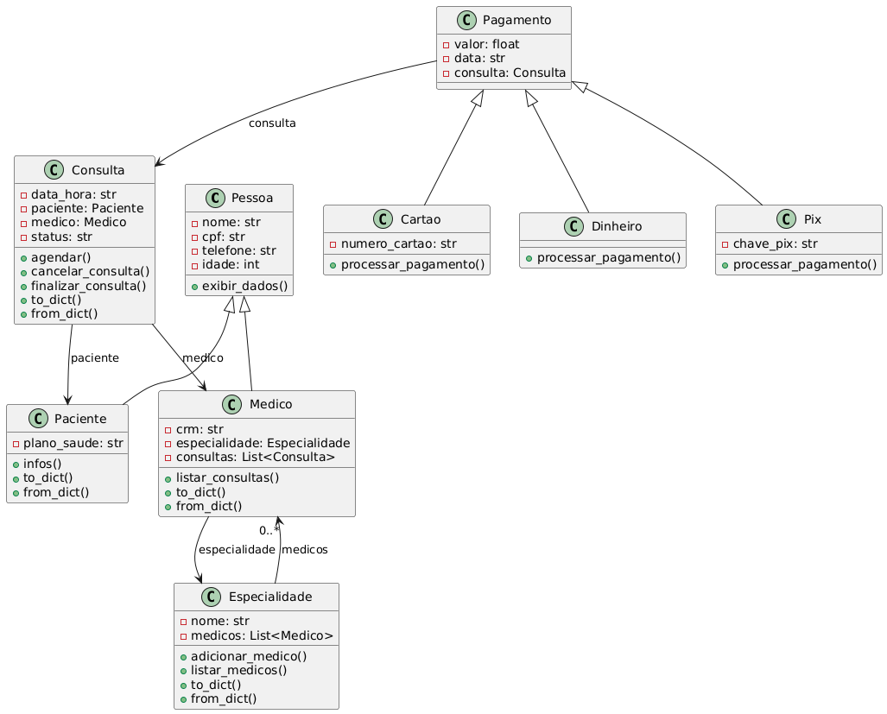

#  Sistema de Gestão de Clínica Médica — Projeto Livre

Este é um sistema de gestão para clínicas médicas desenvolvido em **Python** com **Flask**. Ele permite cadastrar e gerenciar pacientes, médicos, especialidades, agendar consultas, registrar prontuários e processar pagamentos.

##  Tecnologias Utilizadas

- Python 3
- Flask
- HTML5 & CSS3
- Jinja2 (templates do Flask)
- JSON (persistência local)

##  Estrutura do Projeto
```
PROJETO LIVRE/
│
├── app.py # Arquivo principal do servidor Flask
├── README.md # Documentação do projeto
├── .gitignore # Arquivos/pastas ignorados pelo Git
│
├── package/ # Módulos Python da lógica do sistema
│ ├── models.py
│ ├── persistencia.py
│ └── utilitarios.py
│
├── templates/ # Arquivos HTML (views Jinja2)
│ ├── base.html # Template base com layout comum
│ ├── index.html # Página inicial
│ ├── agendar_consulta.html
│ ├── cadastrar_medicos.html
│ ├── cadastrar_pacientes.html
│ ├── consultas.html
│ ├── editar_medicos.html
│ ├── editar_paciente.html
│ ├── listar_medicos.html
│ ├── listar_pacientes.html
│ ├── medicos.html
│ └── pagar_consulta.html
│
├── imagens/ # Imagens usadas no projeto
│ └── paginicial.png
│
├── .venv/ # Ambiente virtual Python
├── .idea/ # Configurações do VS Code ou PyCharm
└── pycache/ # Cache Python (ignorado pelo Git)

```
##  Funcionalidades

- Cadastro, edição e listagem de **médicos**, **pacientes** e **especialidades**
- **Agendamento e visualização de consultas**
- **Pagamentos de consultas**
- Interface web com templates HTML e CSS
- Persistência de dados via arquivos JSON

## Como Executar

1. **Clone o repositório**

```bash
git clone https://github.com/giovannabrito19/PROJETO-LIVRE.git
cd "PROJETO LIVRE"
```

2. **Crie e ative o ambiente virtual**

```bash
python -m venv .venv
# Linux/macOS
source .venv/bin/activate
# Windows
.venv\Scripts\activate
```

3. **Instale as dependências**

```bash
pip install flask
```

4. **Execute o sistema**

```bash
python app.py
```

5. Acesse http://localhost:5000 no navegador.

## Capturas de Tela


## Autoria

Autora: Giovanna Brito
GitHub: @giovannabrito19

# Casos de Uso do Sistema de Gestão de Clínica Médica

---

## 1. Cadastrar Paciente

**Nome:** Cadastrar Paciente

**Ator Principal:** Recepcionista

**Atores Secundários:** Sistema

**Pré-condições:**

- O sistema deve estar em execução.

**Fluxo Principal de Eventos:**  
1. Usuário acessa a tela de cadastro de pacientes.  
2. Preenche formulário com: nome, CPF, data de nascimento, telefone, e-mail e endereço.  
3. Clica em "Cadastrar".

**Pós-condição:**

- Paciente cadastrado para uso no sistema.

**Regras de Negócio:**

- Campos obrigatórios devem estar preenchidos.

---

## 2. Cadastrar Médico

**Nome:** Cadastrar Médico

**Ator Principal:** Recepcionista

**Atores Secundários:** Sistema

**Pré-condições:**

- Sistema em funcionamento.

**Fluxo Principal de Eventos:**  
1. Usuário acessa a tela de cadastro de médicos.  
2. Preenche formulário com: nome, CPF, CRM, especialidade, telefone e e-mail.  
3. Clica em "Cadastrar".

**Pós-condição:**

- Médico registrado e disponível para consultas.

**Regras de Negócio:**

- Médico deve ter especialidade.  
- Campos obrigatórios devem estar preenchidos.

---

## 3. Agendar Consulta

**Nome:** Agendar Consulta

**Ator Principal:** Recepcionista

**Atores Secundários:** Sistema, Médico

**Pré-condições:**

- Paciente cadastrado.  
- Médicos e especialidades cadastrados.

**Fluxo Principal de Eventos:**  
1. Recepcionista acessa o sistema via navegador.  
2. Navega até a página de agendamento.  
3. Preenche formulário: nome, especialidade, médico (opcional), data/hora, observações (opcional).  
4. Sistema verifica disponibilidade.  
5. Se disponível, registra consulta, salva no JSON e confirma agendamento.

**Pós-condição:**

- Consulta armazenada e visível para administrador.

**Regras de Negócio:**

- Médico e paciente devem existir.

---

## 4. Gerenciar Consultas

**Ator Principal:** Recepcionista

**Atores Secundários:** Sistema

**Pré-condições:**

- Consultas cadastradas.

**Fluxo Principal de Eventos:**  
1. Usuário acessa a tela de gerenciamento.  
2. Sistema exibe lista de consultas com filtros.  
3. Usuário pode: visualizar, finalizar ou cancelar.  
4. Sistema atualiza JSON conforme alterações.

**Pós-condição:**

- Consultas finalizadas ou canceladas.

**Regras de Negócio:**

- Consulta cancelada não pode ser reativada.

---

## 5. Listar/Editar Médicos

**Ator Principal:** Recepcionista

**Atores Secundários:** Sistema

**Pré-condições:**

- Médicos cadastrados.

**Fluxo Principal de Eventos:**  
1. Usuário acessa a tela de médicos.  
2. Sistema exibe médicos com botão de edição.  
3. Usuário pode alterar dados do médico ou somente visualizar.  
4. Sistema salva alterações no JSON.

**Pós-condição:**

- Dados dos médicos atualizados.

---

## 6. Editar Paciente

**Ator Principal:** Recepcionista

**Atores Secundários:** Sistema

**Pré-condições:**

- Paciente cadastrado.

**Fluxo Principal de Eventos:**  
1. Usuário acessa lista de pacientes.  
2. Seleciona paciente e edita dados.  
3. Clica em "Salvar".  
4. Sistema atualiza JSON.

**Pós-condição:**

- Dados do paciente atualizados.

---

## 7. Registrar Pagamento

**Ator Principal:** Recepcionista

**Atores Secundários:** Sistema

**Pré-condições:**

- Consulta agendada.

**Fluxo Principal de Eventos:**  
1. Usuário acessa lista de consultas.  
2. Seleciona consulta.  
3. Informa valor e forma de pagamento.  
4. Sistema marca consulta como paga.

**Pós-condição:**

- Consulta paga com sucesso.

---

# Fim dos Casos de Uso


## Diagrama de Classes

